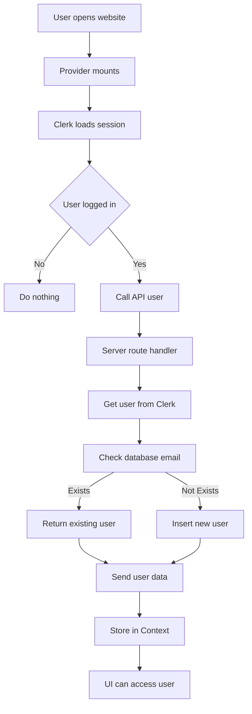
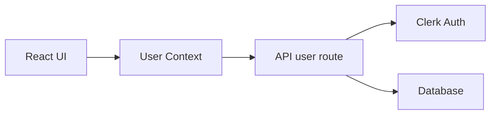
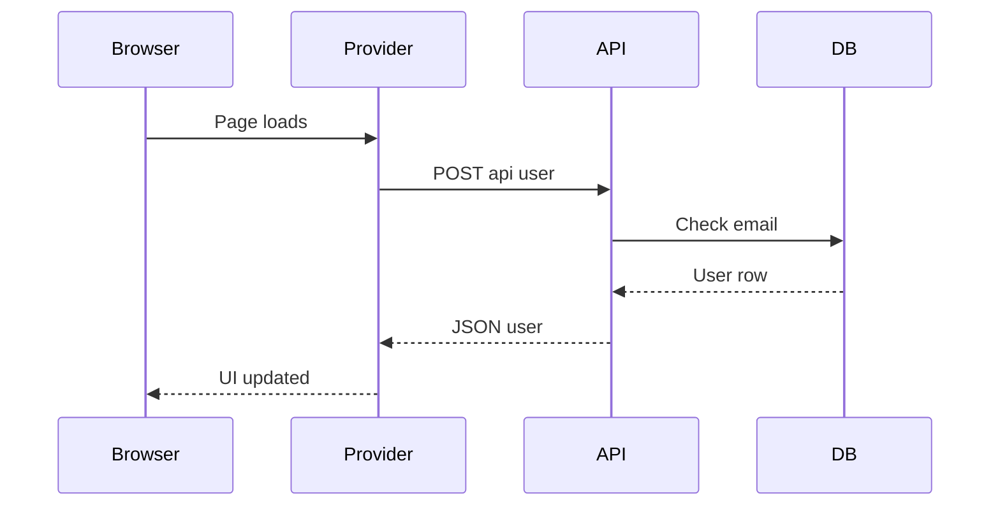

## User creation flow

```mermaid
flowchart TD
    A[User opens website] --> B[Provider mounts]
    B --> C[Clerk loads session]
    C --> D{User logged in}

    D -->|No| E[Do nothing]
    D -->|Yes| F[Call API user]

    F --> G[Server route handler]
    G --> H[Get user from Clerk]
    H --> I[Check database email]

    I -->|Exists| J[Return existing user]
    I -->|Not Exists| K[Insert new user]

    J --> L[Send user data]
    K --> L

    L --> M[Store in Context]
    M --> N[UI can access user]
```

---

## System layers

```mermaid
flowchart LR
    UI[React UI] --> Context[User Context]
    Context --> API[API user route]
    API --> Auth[Clerk Auth]
    API --> DB[Database]
```

---

## Page refresh behaviour

```mermaid
sequenceDiagram
    participant Browser
    participant Provider
    participant API
    participant DB

    Browser->>Provider: Page loads
    Provider->>API: POST api user
    API->>DB: Check email
    DB-->>API: User row
    API-->>Provider: JSON user
    Provider-->>Browser: UI updated
```